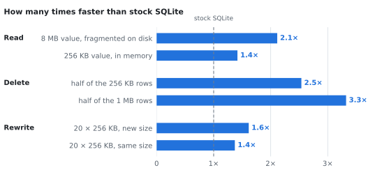

# OvVec

Make SQLite faster at reading, deleting and rewriting large values.

OvVec is a patch for SQLite 3.53.4. A value larger than one database page
(4 KB by default) is stored as a chain of pages, and SQLite handles that chain
one page at a time. OvVec removes most of that per-page work without changing
the file format: databases stay compatible with stock SQLite in both
directions.

<p align="center">
  <picture>
    <source media="(prefers-color-scheme: dark)" srcset="docs/speedup-dark.svg">
    
  </picture>
</p>

- **Reads** pages that sit next to each other in the file with one system call
  instead of one per page.
- **Deletes** a large value without loading every page just to find the next
  one.
- **Rewrites** a large value without first copying the old value into the
  rollback journal.

## Installation

Needs Linux, a C compiler, and the SQLite 3.53.4 source archive
(`sqlite-src-3530400.zip`, from the
[SQLite download page](https://www.sqlite.org/download.html)).

```sh
git clone https://github.com/Juhani1104/OvVec.git
cd OvVec
unzip sqlite-src-3530400.zip && cd sqlite-src-3530400
patch -p1 < ../ovvec.patch
./configure && make sqlite3.c
```

Compile `sqlite3.c` with `-DSQLITE_DIRECT_OVERFLOW_READ` to enable the read and
delete paths.

## Quick start

```sh
bench/build.sh                                # stock and patched builds
python3 bench/compare.py /tmp/ovvec-compare   # generates ~1 GB of test data
```

`compare.py` runs every workload below with both builds in random order and
prints the median time of each, the change, and a `*` where the ranges of the
two builds do not overlap.

## How it works

Each overflow page begins with the number of the next one, so SQLite cannot
find page *n+1* before reading page *n*.

1. **Reading in runs.** After two consecutive pages that are also neighbours
   in the file (in either direction), OvVec reads the next stretch with one
   `preadv()`. The page pointers it reads back confirm the guess.
2. **Deleting without loading pages.** Freeing a chain needs only the 4-byte
   pointer on each page. OvVec reads those in batches instead of loading every
   page into the cache.
3. **Rewriting without the double write.** In the default journal mode, reusing
   a page freed earlier in the same transaction forces SQLite to save the old
   content first. OvVec gives new values pages freed by earlier transactions or
   new pages at the end of the file, which need no saving.
4. **Reads inside write transactions.** Stock SQLite disables its fast path for
   large reads once a transaction has modified anything, as in
   `UPDATE t SET b = f(b)`. OvVec checks the individual page instead.
5. **WAL commits.** One `pwritev()` per commit instead of two writes per page.

## Results

Median of 7 runs on an NVMe SSD (Linux 6.17), SQLite's default settings, both
builds compiled with the same flags. `bench/compare.py` prints the full set.

**Read:** SQLite reads a large value one 4 KB page at a time. OvVec reads
neighbouring pages together, which helps most when the operating system's
read-ahead cannot: values stored out of order on disk.

| reading | stock | OvVec | speed-up |
|---|---:|---:|---:|
| 8 MB value stored back to front, from disk | 124.6 ms | 12.6 ms | **9.9×** |
| 8 MB value stored in 32 KB pieces, from disk | 127.7 ms | 60.4 ms | **2.1×** |
| 8 MB value stored back to front, in memory | 0.50 ms | 0.25 ms | **2.0×** |
| 256 KB value, in memory | 0.017 ms | 0.012 ms | **1.4×** |

**Delete:** Stock SQLite loads every page of a value just to find the next one.
The work OvVec skips is per page, so the larger the values, the bigger the
gain.

| deleting half of the rows | stock | OvVec | speed-up |
|---|---:|---:|---:|
| 1,600 rows of 64 KB | 27.1 ms | 17.1 ms | **1.6×** |
| 400 rows of 256 KB | 20.3 ms | 8.0 ms | **2.5×** |
| 100 rows of 1 MB | 18.6 ms | 5.6 ms | **3.3×** |

**Rewrite:** Rewriting 20 values of 256 KB in one transaction makes stock
SQLite copy the old values into the rollback journal, 26 MB in total. OvVec
writes 0.2 MB there. Less data to write and flush to disk:

| rewriting 20 × 256 KB per transaction | stock | OvVec | speed-up |
|---|---:|---:|---:|
| new values of a different size | 59.1 ms | 36.6 ms | **1.6×** |
| new values of the same size | 54.3 ms | 39.6 ms | **1.4×** |

In WAL mode, batching each commit into one write makes inserts about 10%
faster.

**Correctness:**

- SQLite's own test suite passes, apart from 2 tests that expect the old page reuse.
- We killed the process in the middle of a transaction 480 times. Each time,
  the database came back exactly as it was before that transaction started.
- Database content matches stock SQLite after every workload.

## Reproducing

| step | command |
|---|---|
| build | `bench/build.sh` (needs `sqlite-src-3530400.zip` in the repository root) |
| speed | `python3 bench/compare.py WORKDIR [ROUNDS]` |
| crash recovery | `bench/recovery.sh WORKDIR` |
| value sizes in a database | `bench/tools/chainsize.sh FILE.db` |

## Repository layout

```
ovvec.patch        the patch (btree.c, btreeInt.h, os.h, os_unix.c,
                   pager.c, pager.h, wal.c)
bench/             build script, benchmark and crash-test drivers
bench/tools/       replay, fuzzing and inspection tools
bench/README.md    detailed notes on the read path and its measurement
docs/              the chart above and the script that draws it
```

## Limitations

- Results so far are from synthetic workloads.
- Values smaller than about 16 KB are unaffected.
- The rewrite improvement applies to the rollback-journal modes (SQLite's
  default), not to WAL.
- Linux only, built and tested against SQLite 3.53.4.

## License

[CC0 1.0](LICENSE)
