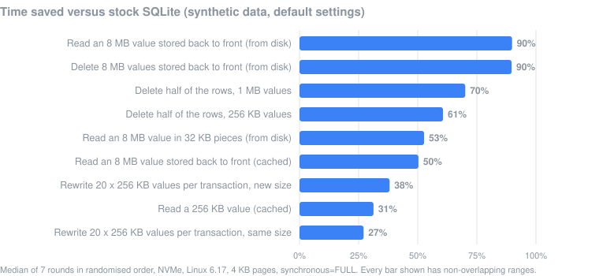

# OvVec

Make SQLite faster at reading, deleting and rewriting large values.

OvVec is a patch for SQLite 3.53.4. When a value is larger than one database
page (4 KB by default), SQLite stores it as a chain of pages, each pointing to
the next, and handles that chain one page at a time. OvVec cuts most of that
per-page work. It does not change the file format: databases written by OvVec
open in any SQLite, and the other way round.



*Synthetic benchmarks on one machine. See [Results](#results) for the full
table and [Limitations](#limitations) for how this holds up on real data.*

- **Reads** pages that sit next to each other in the file with one system call
  instead of one per page.
- **Deletes** a large value without loading every page just to find the next
  one.
- **Rewrites** a large value without first copying the old value into the
  rollback journal.

> **Honest summary.** Every number above comes from synthetic data built to
> contain large values. On the real-world databases we could test, the gains
> were small or zero, mostly because real databases rarely store values big
> enough for any of this to matter. Details in [Limitations](#limitations).

## Installation

You need Linux, a C compiler, and the SQLite 3.53.4 source archive
(`sqlite-src-3530400.zip`, from the
[SQLite download page](https://www.sqlite.org/download.html)).

```sh
git clone https://github.com/Juhani1104/OvVec.git
cd OvVec
# put sqlite-src-3530400.zip here, then:
unzip sqlite-src-3530400.zip
cd sqlite-src-3530400
patch -p1 < ../ovvec.patch
./configure && make sqlite3.c      # produces the patched amalgamation
```

Compile `sqlite3.c` with `-DSQLITE_DIRECT_OVERFLOW_READ`. The read and delete
improvements live behind that option (it is not on by default in SQLite); the
rewrite and WAL improvements work either way.

## Quick start

```sh
bench/build.sh                                # stock and patched builds
python3 bench/compare.py /tmp/ovvec-compare   # about 1 GB of test data
```

`compare.py` creates the test databases, runs every workload with both builds
in random order, and prints a table like the one in [Results](#results): the
median time for each build, the change, and a `*` where the two builds' ranges
do not overlap at all.

## How it works

A value bigger than a page is split across *overflow pages*. Each overflow page
starts with the number of the next one, so SQLite can only find page *n+1*
after reading page *n*.

1. **Reading in runs.** Overflow pages are often stored next to each other in
   the file, sometimes in reverse order (that happens after a large delete,
   when SQLite hands the freed pages back highest first). Once OvVec has seen
   two consecutive pages in a row, it guesses the next stretch is laid out the
   same way and reads it with one `preadv()`. The page pointers it reads
   confirm or reject the guess, so a wrong guess costs time, never
   correctness.
2. **Deleting without loading pages.** To free a chain, SQLite needs only the
   4-byte pointer at the start of each page, but it loads every page into its
   cache to get it. OvVec reads the pointers in batches and skips the cache.
3. **Rewriting without the double write.** In the default journal mode, SQLite
   saves the old content of any page before overwriting it, so a crash can be
   rolled back. When a transaction frees pages and immediately reuses them for
   a new value, SQLite must first copy the old value into the journal: the
   data is written twice. OvVec gives new values pages that were freed by an
   earlier transaction, or new pages at the end of the file, neither of which
   needs saving. Same-size replacements, which SQLite normally overwrites in
   place, take this path too when most of the value changes.
4. **Reads inside write transactions.** Stock SQLite turns off its fast path
   for large reads whenever the current transaction has modified anything, as
   in `UPDATE t SET b = f(b)`. OvVec checks the specific page instead.
5. **WAL commits.** In WAL mode, each page of a commit is written with two
   system calls. OvVec writes the whole commit with one `pwritev()`. The
   effect is small (see below).

## Results

Stock SQLite 3.53.4 against the same version with `ovvec.patch`, both compiled
with `-O2 -DSQLITE_DIRECT_OVERFLOW_READ`. Median of 7 rounds, builds run in a
random order each round. NVMe SSD with XFS, Linux 6.17, 4 KB pages, writes with
`synchronous=FULL` (SQLite's default) unless noted. `*` = the ranges of the
two builds do not overlap.

| workload | stock | OvVec | change |
|---|---:|---:|---:|
| Read an 8 MB value stored in order, cached | 0.44 ms | 0.30 ms | −31% |
| Read an 8 MB value stored back to front, cached | 0.50 ms | 0.25 ms | **−50%\*** |
| Read an 8 MB value stored back to front, from disk | 124.6 ms | 12.6 ms | **−90%\*** |
| Read an 8 MB value stored in 32 KB pieces, from disk | 127.7 ms | 60.4 ms | **−53%\*** |
| Read a 256 KB value, cached | 0.017 ms | 0.012 ms | **−31%\*** |
| Read a 1 MB value, cached | 0.06 ms | 0.03 ms | −44% |
| Delete half of 1,600 rows of 64 KB | 27.1 ms | 17.1 ms | **−37%\*** |
| Delete half of 400 rows of 256 KB | 20.3 ms | 8.0 ms | **−61%\*** |
| Delete half of 100 rows of 1 MB | 18.6 ms | 5.6 ms | **−70%\*** |
| Delete 8 MB values stored back to front, from disk | 749.6 ms | 76.9 ms | **−90%\*** |
| Rewrite 20 × 256 KB per transaction, new size | 59.1 ms | 36.6 ms | **−38%\*** |
| Rewrite 20 × 256 KB per transaction, same size | 54.3 ms | 39.6 ms | **−27%\*** |
| Rewrite 20 × 256 KB per transaction, new size, `synchronous=OFF` | 31.4 ms | 12.8 ms | **−59%\*** |
| Rewrite 1 × 256 KB per transaction, same size, `synchronous=OFF` | 7.5 ms | 4.7 ms | **−37%\*** |
| WAL: insert 2,000 rows, `synchronous=NORMAL` | 21.0 ms | 19.1 ms | −9% |
| WAL: insert 2,000 rows, `synchronous=OFF` | 17.1 ms | 14.9 ms | −13% |

Rewrites also write much less: replacing 20 values of 256 KB per transaction
put 26 MB into the rollback journal with stock SQLite and 0.2 MB with OvVec.

**Correctness.** All of the following pass on the patched build:

| check | result |
|---|---|
| SQLite's own test suite (`make quicktest`) | 978,708 tests; 2 tests fail, both because they assert the old page-reuse behaviour (below) |
| Crash in the middle of a transaction, then recover with stock SQLite | 480 of 480 recovered to exactly the last commit (rollback journal and WAL) |
| Database content after the read, delete and rewrite workloads, compared with stock SQLite | identical (deletes byte for byte) |
| The same, built with AddressSanitizer, UBSan and SQLite's debug checks | no reports |

The two failing tests are `shortread1.test`, which checks that a page freed by
a `DELETE` is reused by an `INSERT` in the same transaction, and `pager1.test`
case 5.5.1, which rewrites large values as a quick way to build a big journal.
OvVec deliberately does neither.

## Reproducing

| step | command | needs |
|---|---|---|
| build | `bench/build.sh` | `sqlite-src-3530400.zip` in the repository root, gcc, unzip |
| speed | `python3 bench/compare.py WORKDIR [ROUNDS]` | ~1 GB in `WORKDIR`, ~10 minutes at 7 rounds |
| crash recovery | `bench/recovery.sh WORKDIR` | a few minutes |
| inspect a database | `bench/tools/chainsize.sh FILE.db` | any `sqlite3` built with `SQLITE_ENABLE_DBSTAT_VTAB` (set `SQLITE3=`) |

`chainsize.sh` shows how many of a database's large values are big enough for
OvVec to matter. It reports only counts, never content, and opens the file
read-only.

Timings on a shared or busy machine are noisy. Use several rounds, and do not
trust a single run: alternating the two builds in a fixed order is biased
enough to make up differences that are not there.

## Repository layout

```
ovvec.patch          the patch (btree.c, btreeInt.h, os.h, os_unix.c,
                     pager.c, pager.h, wal.c)
bench/build.sh       builds stock and patched SQLite and every driver
bench/compare.py     the comparison in Results
bench/recovery.sh    the crash-recovery check
bench/*.c            the benchmark and test drivers
bench/tools/         replay, fuzzing and inspection tools
bench/README.md      detailed notes on the read path and how it was measured
docs/results.svg     the chart above
LICENSE              CC0 1.0
```

## Limitations

**Real data.** This is the important one.

- *Most real databases store small values.* Public SQLite datasets we
  downloaded (map tiles, the SQLite project's own Fossil repository) average
  0.7 to 5 KB per value. OvVec does nothing below about 16 KB, and the read
  path needs about 64 KB.
- *Even where large values exist, they may not dominate the time.* In NOAA's
  official nautical chart files (MBTiles), 12.5% of the images are between
  16 KB and 100 KB and make up 45% of the bytes, yet deleting half of them took
  the same time with and without OvVec. Each deleted row also costs index and
  page updates and journal writes, and for the many small images that is all
  there is.
- *The largest numbers need values stored back to front.* That only happens
  after a large delete in a database with `auto_vacuum=NONE` (SQLite's
  default). Firefox, for example, uses `auto_vacuum=INCREMENTAL`. In databases
  written by Firefox itself, values were stored in order, and reads were 24% to
  41% faster for cached values of 64 KB to 768 KB; from disk, only values of
  256 KB and up gained (25% to 53%). Firefox also moves values over 1 MB out of
  SQLite into separate files, so that is where the useful range ends.

**Other limits.**

- Values under 16 KB: no effect. Reads of in-order values from disk: no
  effect, because the operating system's read-ahead already does the batching.
- Rewrites help only in the default rollback-journal mode, and only when a
  transaction rewrites more than one large value or replaces a value with one
  of the same size. The file grows by up to one transaction's worth of
  rewritten data (+8.5% for the 20 × 256 KB case), which the next transaction
  reuses.
- The WAL improvement is small and was not consistently distinguishable from
  noise.
- Linux only (`preadv`/`pwritev`), SQLite 3.53.4 only, and not part of upstream
  SQLite.

## License

[CC0 1.0](LICENSE): no rights reserved. SQLite itself is in the public domain,
and this patch follows it.
